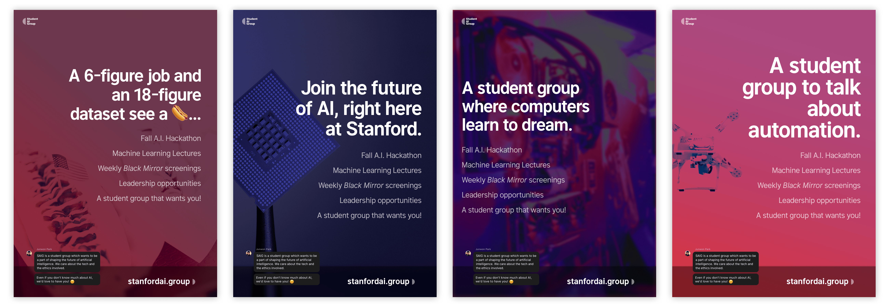

Founded in 2017, Student AI Group (SAIG) is a student organization at Stanford University. At its core, SAIG works to connect students to opportunities in the growing field of Artificial Intelligence.

---

  <a
    href="https://join.slack.com/t/stanfordaigroup/shared_invite/enQtMTkyNDIyNjkzMzQ5LTMxMzJlYjY5MGJlOTA5OGNjOWQ5NDMyMGUzNGQ5NmE3MzdmYWYzMDU4YTViMjZkODlhNmI0MGRmNGM5YmMwMDg"
    class="messages__message messages__message-slack"
    rel="noopener noreferrer"
    target="_blank"
  >
    <h3>Join us on Slack</h3>
    
Give us a hello! 👋

  </a>

---

# Current Board

**Junwon Park** 
<small>President</small>

**Tucker Haas** 
<small>Chief Financial Officer</small>

**Andrew Lee** 
<small>Vice President of Public Relations</small>

**Joseph Nicolls** <small>*&*</small> **Roma Dziembaj** 
<small>Vice Presidents of Operations</small>

**John Romano** <small>*&*</small> **Prasad Kawthekar** 
<small>Vice Presidents of Technical Education</small>

**Andrew Lesh** <small>*&*</small> **Dylan Bedford** 
<small>Vice Presidents of Ethical Education</small>

**Alex Long** 
<small>Ex Officio Board Member</small>

---

### Colophon

Website created by [Andrew Lee](https://andrewlee.design/), open source on [GitHub](https://github.com/andrewsoohwanlee/stanfordai.group).

---

